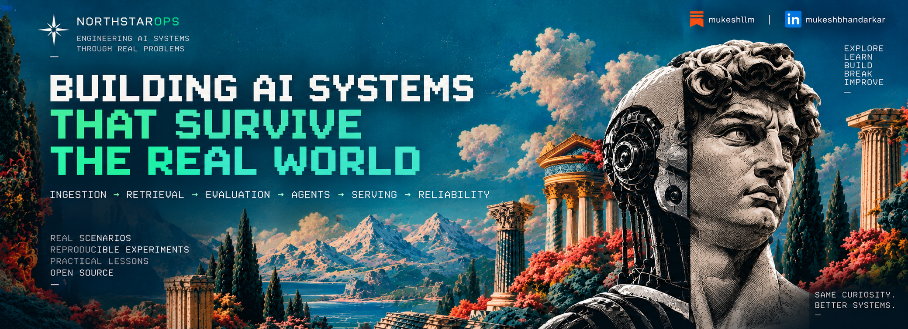
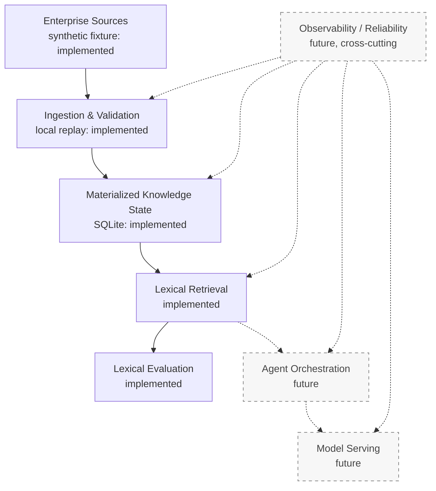

# NorthstarOps

> Building AI Systems That Survive the Real World

NorthstarOps is an evidence-driven, production-style AI/ML systems engineering series. It builds one system incrementally through realistic simulated failure modes, introducing infrastructure only when a measured requirement or reproduced failure justifies it. NorthstarOps and its customer scenarios are fictional; this is an independent engineering case study, not a production deployment or claim of employer experience.

<p align="center">
  
</p>

## What is NorthstarOps?

NorthstarOps explores an incident-investigation and technical-support intelligence system for a fictional B2B SaaS company. Its first fictional tenant, AcmePay, gives the project a concrete setting: engineers need to connect a deployment with recent pull requests, operational documentation, support reports, and related historical incidents without confusing correlation for proof.

Changing runbooks, architecture documents, pull requests, incidents, support tickets, and deployment records will eventually feed the system. Metrics and raw logs remain behind dedicated tools rather than being blindly embedded into a knowledge store.

## Why build it this way?

The project follows a single engineering loop:

```text
requirement → naive baseline → failure → instrumentation → evidence
→ root cause → architecture change → benchmark → trade-off → next failure
```

Each change should answer an observed need. Simulated failures produce reproducible evidence; they are not presented as real production incidents.

## The system we're building

This is the long-term direction. The synthetic source fixture, local validation/replay path, SQLite materialized state, and deterministic lexical retrieval/evaluation are implemented today. Dashed components remain future work.



## Engineering lessons

| # | Lesson | Engineering problem | Status |
| --- | --- | --- | --- |
| 01 | Trust the Data Before You Retrieve It | Deletions, stale events, idempotency, tombstones | **PUBLISHED** |
| 02 | Build a Retrieval Baseline Before Embeddings | Lexical retrieval, evidence coverage, failure analysis | **CURRENT** |
| 03 | When Lexical Search Stops Being Enough | Dense retrieval, hybrid search, reranking | PLANNED |
| 04 | Fresh Data Is a Feature | Event ingestion, indexing lag, freshness SLOs | PLANNED |
| 05 | Make the Agent Prove Its Answer | Tools, evidence, citations, bounded workflows | PLANNED |
| 06 | What Happens When the Agent Retries? | Idempotent tools, checkpoints, side effects, Redis | PLANNED |
| 07 | Serving the Model Is a Systems Problem | vLLM, batching, queues, TTFT, throughput | PLANNED |
| 08 | Round-Robin Was Killing Our KV Cache | KV-aware routing, locality, worker discovery | PLANNED |
| 09 | The Cache Hit Rate Looked Great. p99 Didn't. | LMCache, eviction, hot prefixes, tail latency | PLANNED |
| 10 | Break the System Before Users Do | Failure injection, observability, SLOs, recovery | PLANNED |

## Current implementation

The Lesson 01 baseline, frozen at tag [`lesson-01`](https://github.com/mukeshbhandarkar/northstar-ai-platform/tree/lesson-01), contains a Python 3.12 standard-library implementation with:

- SQLite materialized document state keyed by `(tenant_id, document_id)`.
- Event-envelope, payload-reference, checksum, identity, version, and timestamp validation.
- Separate event-ID idempotency and source-version ordering.
- Tombstones that prevent stale updates from restoring deleted content.
- Legitimate restoration through a strictly newer upsert.
- Atomic document-state, version-history, and processed-event bookkeeping in one SQLite transaction.
- Tenant-scoped state inspection with tenant predicates in SQL.
- A deterministic synthetic enterprise fixture, replay tooling, manifest comparison, and standard-library tests.

The fixture has **2 synthetic tenants**, **24 logical document identities**, **33 event deliveries**, and **29 unique event IDs**. Lesson 01 has 22 processor tests; NORTH-004 adds 15 retrieval/evaluation tests.

The deterministic replay produces these correctness observations:

| Replay | APPLIED | DUPLICATE | STALE | INVALID |
| --- | ---: | ---: | ---: | ---: |
| Fresh database | 27 | 4 | 2 | 0 |
| Same database replayed again | 0 | 33 | 0 | 0 |

The second replay leaves the visible materialized state unchanged. These counts describe this fixed fixture; they are not performance benchmarks or production-scale results.

## Lesson 01 — Trust the Data Before You Retrieve It

The central failure experiment is simple: **a new event ID does not imply newer source state**.

```text
v1 upsert → v2 update → v3 delete → previously unseen event carrying v2 → v4 restore
```

An implementation that tracks only event IDs accepts the unseen late event and incorrectly resurrects v2 after the v3 deletion. The actual processor compares source versions independently, returns `STALE`, and preserves the v3 tombstone. Only the strictly newer v4 upsert restores the document.

The implementation and evidence are in:

- [`services/processor/store.py`](services/processor/store.py) — transaction, event identity, version ordering, and tombstone state.
- [`services/processor/processor.py`](services/processor/processor.py) — envelope and payload validation.
- [`tests/test_processor.py`](tests/test_processor.py) — rollback, replay, isolation, and controlled stale-resurrection tests.
- [`datasets/synthetic_enterprise/events.json`](datasets/synthetic_enterprise/events.json) — deterministic delivery sequence.

## Reproduce it locally

Use Python 3.12 from the repository root. There are no third-party runtime or test dependencies.

```bash
python scripts/validate_dataset.py
python -m unittest discover -s tests -v
```

Replay into a fresh local database, then replay the same events against the retained state:

```bash
python scripts/replay_events.py \
  --dataset datasets/synthetic_enterprise \
  --db /tmp/northstar-state.db \
  --fresh

python scripts/replay_events.py \
  --dataset datasets/synthetic_enterprise \
  --db /tmp/northstar-state.db
```

`--fresh` deletes the selected SQLite database and its `-journal`, `-wal`, and `-shm` sidecar files before replay. Use it only with a dedicated local database that no other process is using.

## Repository structure

```text
.
├── benchmarks/                     # Measurement contract and lexical run artifact
├── datasets/
│   └── synthetic_enterprise/       # Versioned documents, events, labels, manifest
├── docs/
│   ├── architecture/               # Baseline design and decision log
│   ├── product/                    # Fictional company and customer context
│   └── requirements/               # Requirements and initial targets
├── scripts/                        # Validation, replay and retrieval evaluation
├── services/
│   ├── processor/                  # Validation, processing, SQLite state
│   └── retrieval/                  # Current-state lexical matching
└── tests/                          # Correctness and failure tests
```

## Engineering documentation

- [Product and simulation context](docs/product/company-context.md)
- [NORTH-001 engineering baseline](docs/requirements/NORTH-001.md)
- [NORTH-002 synthetic dataset and ground truth](docs/requirements/NORTH-002.md)
- [NORTH-003 local event processing](docs/requirements/NORTH-003.md)
- [NORTH-004 lexical retrieval and evaluation](docs/requirements/NORTH-004.md)
- [Proposed v0 architecture](docs/architecture/v0-baseline.md)
- [Architecture decision log](docs/architecture/decision-log.md)
- [Dataset contract and fixture layout](datasets/synthetic_enterprise/README.md)
- [Benchmark contract](benchmarks/README.md)
- [Initial SLO/SLI targets](docs/requirements/slo-sli.md)

## Current limitations

This is a local, single-process, CPU-first experiment using SQLite and synthetic tenants/data. Retrieval uses deterministic title/body token overlap over current tenant-scoped rows. It has no LLM inference, vector database, Kafka, Redis, vLLM, LMCache, or Kubernetes. The eight-case local evaluation does not establish production-scale performance.

These are deliberate boundaries. Later components should be introduced only when a requirement or reproduced failure makes their cost and trade-offs measurable.

## Roadmap

- **Completed:** trustworthy materialized source state (Lesson 01).
- **Current:** deterministic retrieval baseline and evaluation (Lesson 02).
- **Later:** hybrid retrieval; freshness and event streaming; bounded agents; model serving; KV/cache experiments; observability and failure recovery.

## Articles

### Lesson 01 — A New Event Isn't New State

A new event ID does not guarantee newer source state. Lesson 01 investigates stale-event resurrection, version ordering, tombstones, atomic writes, replay convergence, and the mutation experiment that exposed a weakness in the original test.

**[Read Lesson 01 on Substack →](https://mukeshllm.substack.com/p/a-new-event-isnt-new-state)**

Reproduce the committed Lesson 01 implementation from the frozen [`lesson-01`](https://github.com/mukeshbhandarkar/northstar-ai-platform/tree/lesson-01) tag.

### Lesson 02 — Build a Retrieval Baseline Before Embeddings

**Baseline implemented.** A standard-library retriever scores distinct title/body token overlap, filters tenants before scoring, and returns at most five current document versions. The evaluator measures required-evidence recall, precision, complete coverage, distractors and latency against the unchanged eight cases.

```bash
.venv/bin/python scripts/evaluate_retrieval.py --repeats 10 --output /tmp/north-004-run.json
```

Use a new output filename. The command creates its own temporary database. See the [methodology](docs/requirements/NORTH-004.md), [benchmark instructions](benchmarks/README.md), and [baseline JSON report](benchmarks/results/north-004-baseline.json).

## Author

Mukesh Bhandarkar

- GitHub: [mukeshbhandarkar](https://github.com/mukeshbhandarkar)
- Substack: `mukeshllm`
