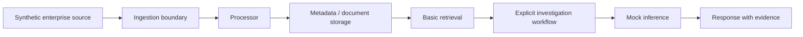

# Proposed v0 baseline

Design only: none of these components is implemented in NORTH-001. The future baseline should run as one local Python 3.12 process on CPU, with synthetic files and standard-library storage where practical. SQLite for metadata, document text, and event bookkeeping is a provisional implementation choice, not a dependency or schema added here.

## Responsibilities

| Component | Proposed responsibility |
| --- | --- |
| Synthetic source | Emit bounded, deterministic versioned documents and change events; expose source-commit timing to the future benchmark harness. |
| Ingestion boundary | Validate required fields, tenant context, envelope/payload agreement, and checksums; reject invalid input explicitly. |
| Processor | Apply upserts/deletes sequentially, deduplicate events, reject conflicting versions, and retain tombstones. |
| Storage | Persist latest document state keyed by tenant and document ID, highest version/tombstone, and processed event identity atomically. |
| Basic retrieval | Filter by tenant before scoring; perform deterministic lexical matching over current, non-deleted text with stable tie-breaking. No embeddings. |
| Investigation workflow | Take tenant, service, question, and time window; retrieve evidence, assemble a timeline, identify missing evidence, then invoke mock inference. |
| Mock inference | Use deterministic templates over supplied evidence; label hypotheses and mock output explicitly. No model/API call. |
| Response | Return findings, uncertainty, and tenant-scoped citations with document IDs and versions; never claim an unverified root cause. |

The diagram describes evidence flow. An engineer's request drives retrieval and the workflow after ingestion; ingestion does not automatically trigger inference. Request tenant context must be required independently of matching text. Authentication and authorization mechanisms remain unresolved; synthetic tenant tests cannot establish a complete security boundary.

## Proposed consistency rules

Use the [dataset contract](../../datasets/synthetic_enterprise/README.md) for version and event semantics. A document's tenant is immutable. Older versions cannot overwrite newer state or resurrect a deleted document. An exact duplicate is a no-op; conflicting content for an existing event ID or document version is an explicit error. A strictly newer upsert can restore a deleted document under the synthetic source contract.

Commit document changes, tombstones, and event bookkeeping together. Future restart tests should verify committed state survives and replay does not corrupt it. Sequential processing deliberately leaves concurrent writers, connector outages, and distributed delivery guarantees outside v0; these need separate requirements.

## Why this is intentionally naive

A local, sequential pipeline exposes freshness, retrieval behavior, and correctness with few moving parts. Lexical retrieval may miss semantic matches; single-process storage limits concurrency; templates do not evaluate language-model reasoning. These are explicit limitations to measure, not hidden claims of capability.

There is no evidence yet for brokers, vector databases, Redis state, orchestration frameworks, GPUs, model servers, KV caches, or routing layers. Adding them now would consume limited resources and confound the baseline. Future changes must name a measured failure, propose an alternative, compare benchmarks under the same conditions, and record the trade-off in the [decision log](decision-log.md).

Metrics and raw logs stay outside knowledge storage. Dedicated telemetry tools are a future boundary; v0 will use only authored synthetic evidence and explicitly identify missing live verification.
